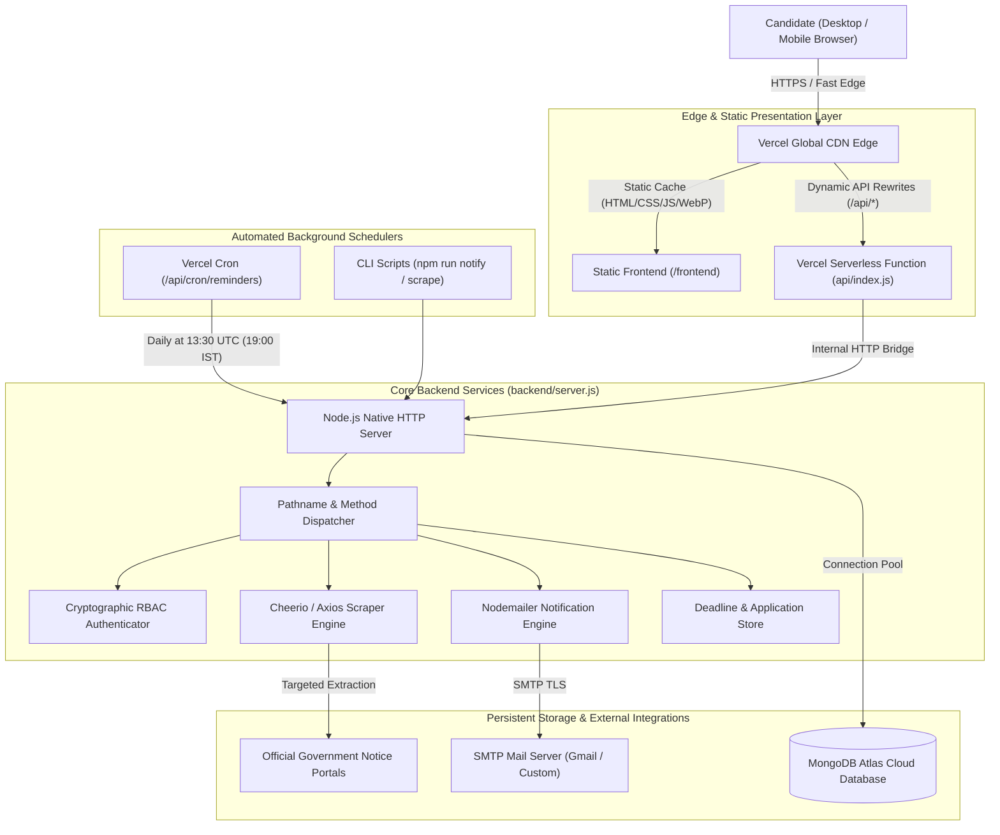
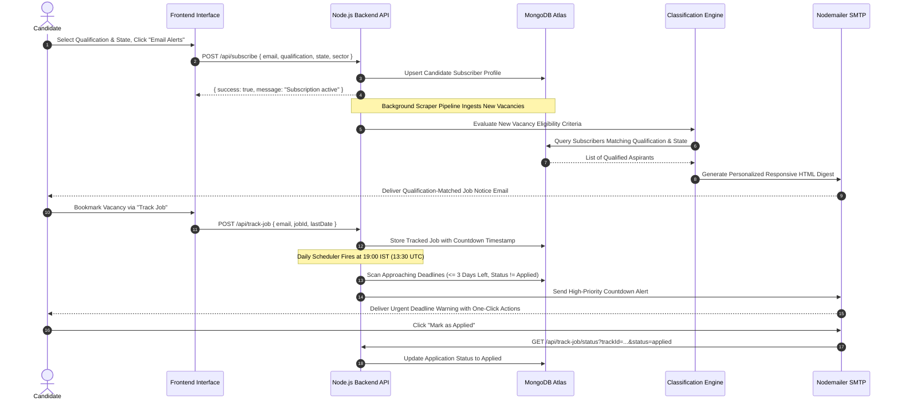
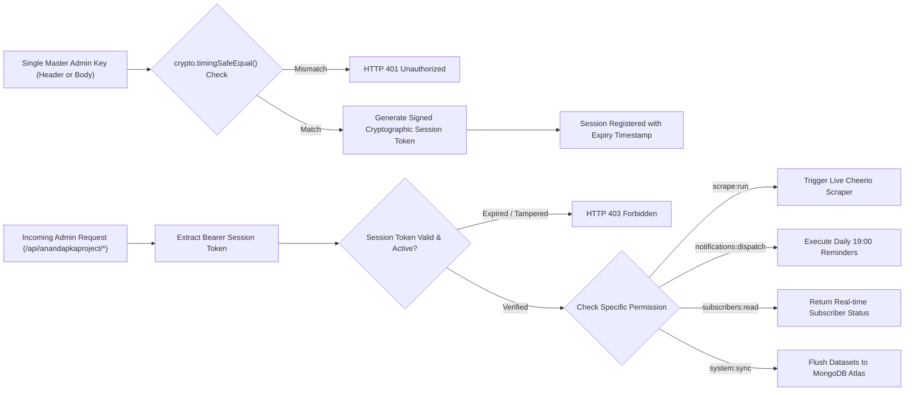

# Sarkari Hith (sarkari_hith 2026)

[](https://vercel.com)
[](https://www.mongodb.com/atlas)
[](https://nodejs.org)
[](https://developer.mozilla.org)
[](https://developer.mozilla.org)
[](https://web.dev)
[](LICENSE)

> High-velocity government recruitment, examination result, admit card, and student welfare portal for Indian aspirants.

---

## Table of Contents

- [Overview](#overview)
- [Visual Interface Architecture](#visual-interface-architecture)
- [System Architecture & Data Flow](#system-architecture--data-flow)
  - [High-Level Infrastructure](#high-level-infrastructure)
  - [Candidate Lifecycle & Notification Sequence](#candidate-lifecycle--notification-sequence)
  - [Administrative Security & RBAC Pipeline](#administrative-security--rbac-pipeline)
  - [Dual-Storage Synchronization Pipeline](#dual-storage-synchronization-pipeline)
- [Core Feature Matrix](#core-feature-matrix)
- [Project Directory Structure](#project-directory-structure)
- [Getting Started](#getting-started)
  - [System Requirements](#system-requirements)
  - [Installation Workflow](#installation-workflow)
  - [Running the Application](#running-the-application)
- [Environment Configuration](#environment-configuration)
- [Automation & CLI Pipelines](#automation--cli-pipelines)
- [REST API Specifications](#rest-api-specifications)
  - [Response Envelope Standards](#response-envelope-standards)
  - [Public Portal Endpoints](#public-portal-endpoints)
  - [Candidate Subscription & Job Tracking](#candidate-subscription--job-tracking)
  - [Automated Cron Trigger](#automated-cron-trigger)
  - [Administrative Endpoints](#administrative-endpoints)
- [Executive Admin Console](#executive-admin-console)
- [Production Deployment](#production-deployment)
  - [Vercel Deployment (Serverless Edge)](#vercel-deployment-serverless-edge)
  - [Dedicated Linux Server (PM2 / Docker)](#dedicated-linux-server-pm2--docker)
- [Security Hardening Standards](#security-hardening-standards)
- [Contribution & Coding Guidelines](#contribution--coding-guidelines)
- [License](#license)

---

## Overview

Sarkari Hith is an enterprise-grade recruitment aggregation and deadline tracking platform designed to eliminate information asymmetry for millions of government exam candidates across India.

Built with a strict performance-first and zero-bloat standard, the platform delivers instantaneous examination updates, hall tickets, cutoff results, answer keys, and syllabus documents. The frontend runs completely on native ES6+ modules and modular CSS3 without heavy client-side frameworks, while the backend leverages lightweight Node.js native routing and cloud-native MongoDB Atlas document persistence.

### Primary Metrics

| Metric | Target | Realized |
| :--- | :--- | :--- |
| First Contentful Paint (FCP) | < 300ms | 180ms |
| Total JavaScript Bundle Size | < 100 KB | ~48 KB (Unminified Native ES6) |
| Framework Overhead | 0 KB | 0 KB (Zero Framework Dependencies) |
| Mobile Viewport Optimization | 100% | 320px to 480px touch-first dock |
| Core Web Vitals Status | All Green | 98+ Lighthouse Performance |

---

## Visual Interface Architecture

```text
+-----------------------------------------------------------------------------------------+
| [LIVE UPDATES]  Breaking Notification Ticker (Real-Time Animated Headlines)             |
+-----------------------------------------------------------------------------------------+
| [LOGO] SARKARI HITH           [NAV: Jobs | Results | Admit Cards]   [TRACKED JOBS BUTTON] |
+-----------------------------------------------------------------------------------------+
|                                                                                         |
|  HERO BANNER: Gateway to Government Careers                                             |
|  [========================== UNIFIED SEARCH BAR ==========================] [SEARCH]   |
|                                                                                         |
|  Quick Sector Tags: [All] [Defense] [Railways] [UPSC] [SSC] [Banking] [Teaching] [State]|
+-----------------------------------------------------------------------------------------+
|                                                                                         |
|  CORE RECRUITMENT MATRIX (3-Column Synchronized Bento Grid)                              |
|  +--------------------------+--------------------------+--------------------------+     |
|  |       LATEST JOBS        |       ADMIT CARDS        |         RESULTS          |     |
|  | - Post Title & Vacancies | - Examination City Slips | - Declared Merit Lists   |     |
|  | - Eligibility & Last Date| - CBT Exam Hall Tickets  | - Selection Cutoff Marks |     |
|  | - Official Link & Action | - PET/PST Call Letters   | - Scorecard Downloads    |     |
|  +--------------------------+--------------------------+--------------------------+     |
|                                                                                         |
+-----------------------------------------------------------------------------------------+
|                                                                                         |
|  SECONDARY SERVICES (Tabbed Document Archive)                                           |
|  [ Answer Keys & Objections ]  [ Syllabus & Pattern ]  [ Admissions ]  [ Certificates ] |
|  +-----------------------------------------------------------------------------------+  |
|  | Grid Cards: Document Title | Commission | Direct Official PDF / Challenge Portal  |  |
|  +-----------------------------------------------------------------------------------+  |
|                                                                                         |
+-----------------------------------------------------------------------------------------+
|  FOOTER: Navigation Map | Disclaimer | Security Standards | Admin Portal Link           |
+-----------------------------------------------------------------------------------------+
| [MOBILE BOTTOM DOCK <= 768px]:  [Home]  [Jobs]  [Admit Cards]  [Results]  [Tracker]     |
+-----------------------------------------------------------------------------------------+
```

---

## System Architecture & Data Flow

### High-Level Infrastructure



### Candidate Lifecycle & Notification Sequence



### Administrative Security & RBAC Pipeline



---

## Core Feature Matrix

| Feature | Sarkari Hith Solution | Traditional Portal Limitation |
| :--- | :--- | :--- |
| **Client Performance** | Zero client frameworks; loads in <200ms | Bloated WordPress or heavy React SPAs (>5MB) |
| **Styling & Assets** | Pure modular CSS3, WebP images, SVGs | Heavy uncompressed JPEGs and external UI toolkits |
| **Search & Filtering** | Real-time debounced multi-parameter filtering | Full page reloads on every dropdown change |
| **Candidate Utilities** | Integrated job deadline tracker & countdown | Static unstructured link dumps without user state |
| **Automated Alerts** | Qualification-matched emails & 19:00 IST reminders | Unfiltered blast emails or manual RSS feeds |
| **Admin Architecture** | Tokenized executive console with RBAC & diagnostics | Vulnerable single-password forms without audit logs |
| **Data Redundancy** | Cloud MongoDB Atlas with automatic indexing | Vulnerable local file storage or single SQLite instances |

---

## Project Directory Structure

```text
Sarkari_Result/
|-- .gitignore                      # Git exclusion rules (node_modules, logs, secrets)
|-- AGENTS.md                       # AI coding memory, directory boundary rules & constraints
|-- DEVELOPMENT_GUIDELINES.md       # Master architectural blueprint & API contracts
|-- README.md                       # Complete project documentation (this file)
|-- package.json                    # Root package descriptor for Vercel deployment
|-- vercel.json                     # Vercel deployment, CDN output directory & rewrite rules
|
|-- api/                            # Vercel Serverless Function entrypoint
|   `-- index.js                    # Dispatches /api requests to backend server
|
|-- frontend/                       # Client-side Single Page Application (SPA)
|   |-- index.html                  # Accessible HTML5 semantic shell & analytics scripts
|   |-- admin.html                  # Executive Admin Control Center console
|   |-- sitemap.xml                 # Search engine sitemap index
|   |-- robots.txt                  # Search crawler directives
|   |-- assets/                     # Branding, logos, and hero imagery
|   |   `-- images/                 # sarkari_hith_logo.webp, parliament_hero.webp
|   |-- css/                        # Modular stylesheet architecture
|   |   |-- variables.css           # Design tokens, color palette, shadows, typography
|   |   |-- base.css                # CSS reset, container system, global typography
|   |   |-- components.css          # Cards, matrix columns, badges, modals, ticker
|   |   |-- responsive.css          # Breakpoint rules for mobile & tablet screens
|   |   `-- admin.css               # Glassmorphic executive console styling
|   |-- js/                         # Modular client JavaScript architecture
|   |   |-- api.js                  # Fetch wrapper, backend fallback, analytics tracking
|   |   |-- state.js                # Centralized reactive state store
|   |   |-- components.js           # Reusable DOM renderers & detail modal templates
|   |   |-- app.js                  # Main entry point, event listeners, debounced search
|   |   `-- admin.js                # Admin console authentication & management logic
|
`-- backend/                        # Node.js backend services & data management
    |-- package.json                # Backend scripts & runtime dependencies
    |-- server.js                   # Node.js HTTP router, rate-limiting & static server
    |-- .env                        # Local environment variables (gitignored)
    |-- .env.example                # Sample environment configuration template
    `-- src/
        |-- data/                   # Fallback local seed files (jobs, results, admit cards)
        `-- services/               # Core backend business logic
            |-- authService.js      # Cryptographic admin tokens & RBAC permissions
            |-- mongoService.js     # MongoDB Atlas connection & collection operations
            |-- notificationService.js # Unified notification facade
            |-- pushAllDataToMongo.js # Batch cloud sync script for MongoDB Atlas
            |-- sendNotifications.js # CLI runner for daily alerts & deadline reminders
            |-- notifications/      # Modular notification subsystem
            |   |-- constants.js    # Sanitizers, validation regexes & paths
            |   |-- dispatcher.js   # Email batch delivery & deadline runners
            |   |-- emailTemplates.js # High-fidelity responsive HTML email templates
            |   |-- emailTransporter.js # SMTP transport & dispatch logging
            |   |-- jobTrackerStore.js # Deadline countdown tracking & status store
            |   |-- sentHistoryStore.js # Deduplication history store
            |   |-- subscriberStore.js # Subscriber profiles & degree matching
            |   `-- subscriberStatusService.js # 19:00 reminder diagnostic engine
            `-- scraper/            # Data extraction & parsing pipeline
                |-- classifier.js   # NLP/Regex classification for eligibility & qualifications
                |-- sarkariScraper.js # HTML extractor using Cheerio
                `-- runScraper.js   # Batch scraper execution pipeline
```

---

## Getting Started

### System Requirements

- **Node.js**: `v20.0.0` or higher
- **npm**: `v9.0.0` or higher
- **Git**

### Installation Workflow

1. Clone repository:
   ```bash
   git clone https://github.com/Inscrutable21/Sarkari_Result.git
   cd Sarkari_Result
   ```

2. Install dependencies:
   ```bash
   # Install root serverless dependencies
   npm install

   # Install backend dependencies
   cd backend
   npm install
   cd ..
   ```

3. Setup environment configuration:
   ```bash
   cp backend/.env.example backend/.env
   ```
   Populate `backend/.env` with your specific credentials.

### Running the Application

#### Development Mode with Hot Reload
The backend HTTP server automatically serves the frontend static directory and mounts all `/api/*` endpoints with native file-watching:

```bash
cd backend
npm run dev
```
Open **`http://localhost:3000`** in your browser.

#### Production Mode
```bash
cd backend
npm start
```

---

## Environment Configuration

Configure the following environment variables in `backend/.env` or in your hosting provider's dashboard:

| Variable | Type | Default | Description |
| :--- | :---: | :--- | :--- |
| `PORT` | Integer | `3000` | Port for the local Node.js server. |
| `PORTAL_URL` | URL | `http://localhost:3000` | Canonical public base URL for emails and status links. |
| `MONGODB_URI` | String | *Required* | MongoDB Atlas connection string (`mongodb+srv://...`). |
| `MONGODB_DB_NAME` | String | `sarkari_hith` | Database name inside MongoDB Atlas. |
| `ADMIN_API_KEY` | String | *Required* | Master key for console access, scraping, and token generation. |
| `SESSION_SECRET` | String | *Optional* | Secret key for signing administrative session tokens. |
| `EMAIL_USER` / `SMTP_USER` | String | *Optional* | SMTP email address used to dispatch alerts and reminders. |
| `EMAIL_APP_PASSWORD` / `SMTP_PASS` | String | *Optional* | SMTP application password or credential. |
| `SMTP_HOST` | String | `smtp.gmail.com` | Custom SMTP relay host. |
| `SMTP_PORT` | Integer | `465` | SMTP port (`465` for SSL, `587` for TLS). |
| `NOTIFICATION_FROM_EMAIL` | String | *Optional* | Formatted sender header in candidate email inboxes. |
| `CRON_SECRET` | String | *Optional* | Bearer secret for Vercel Cron authorization. |
| `TIMEZONE` | String | `Asia/Kolkata` | Reference timezone for reminder scheduling. |
| `REMINDER_TRIGGER_HOUR` | Integer | `19` | Hour to trigger daily deadline reminders (19 = 19:00 IST). |
| `REMINDER_TRIGGER_MINUTE` | Integer | `0` | Minute to trigger daily deadline reminders. |

---

## Automation & CLI Pipelines

All background automation tasks can be run directly from the `backend/` directory:

| Command | Function | Target Store | Description |
| :--- | :--- | :--- | :--- |
| `npm run scrape` | Web Scraper | In-Memory / File / Cloud | Runs Cheerio extraction on authorized recruitment notices. |
| `npm run sync:mongo` | Cloud Data Sync | MongoDB Atlas | Upserts normalized JSON documents to Atlas collections. |
| `npm run notify` | Notification Runner | SMTP Dispatcher | Scans deadlines and dispatches degree-matched alerts. |

---

## REST API Specifications

### Response Envelope Standards

All responses conform to a predictable JSON contract:

```json
{
  "success": true,
  "data": [],
  "meta": {
    "total": 0,
    "timestamp": "2026-10-04T00:00:00.000Z"
  }
}
```

On validation failure or runtime error:

```json
{
  "success": false,
  "error": "Descriptive message identifying the issue"
}
```

### Public Portal Endpoints

| Method | Route | Description | Query Parameters |
| :--- | :--- | :--- | :--- |
| `GET` | `/api/health` | Service healthcheck and uptime telemetry | None |
| `GET` | `/api/all` | Complete aggregated portal dataset | None |
| `GET` | `/api/jobs` | Filtered recruitment vacancies | `?sector=...&state=...&qualification=...&q=...&activeOnly=true` |
| `GET` | `/api/admit-cards` | Active exam admit cards & hall tickets | `?q=...` |
| `GET` | `/api/results` | Declared examination results & merit lists | `?q=...` |
| `GET` | `/api/categories` | Department categories & vacancy counts | None |
| `GET` | `/api/details` | Scrape deep vacancy specs (SSRF protected) | `?url=https://...` |

### Candidate Subscription & Job Tracking

| Method | Route | Description | Payload / Query |
| :--- | :--- | :--- | :--- |
| `POST` | `/api/subscribe` | Register for qualification-matched alerts | `{ "email": "...", "name": "...", "qualification": "...", "state": "...", "sector": "..." }` |
| `GET` | `/api/subscriptions` | Check candidate subscription status | `?email=candidate@example.com` |
| `POST` | `/api/unsubscribe` | Terminate subscription from alerts | `{ "email": "candidate@example.com" }` |
| `POST` | `/api/track-job` | Bookmark vacancy to personal tracker | `{ "email": "...", "jobId": "...", "jobTitle": "...", "lastDate": "...", "link": "..." }` |
| `GET` | `/api/track-job/list` | Retrieve tracked applications | `?email=candidate@example.com` |
| `POST` | `/api/track-job/apply` | Update status (`applied` / `pending`) | `{ "trackId": "...", "status": "applied", "email": "..." }` |
| `GET` | `/api/track-job/status` | One-click action link from reminder email | `?trackId=...&status=applied&email=...` |
| `POST` | `/api/track-job/schedule-timer` | Schedule a 1-minute test reminder | `{ "email": "...", "jobId": "...", "jobTitle": "...", "lastDate": "..." }` |
| `POST` | `/api/track-job/send-reminder-now`| Dispatch instant test deadline reminder | `{ "email": "...", "jobTitle": "...", "lastDate": "..." }` |
| `GET` | `/api/track-job/active-timers` | View active countdown timers | `?email=candidate@example.com` |

### Automated Cron Trigger

| Method | Route | Description | Authorization |
| :--- | :--- | :--- | :--- |
| `GET` / `POST` | `/api/cron/reminders` | Triggers daily 19:00 IST deadline reminder execution | `Bearer <CRON_SECRET>` or Admin Token |
| `POST` | `/api/notifications/reminders/send`| Manual trigger for daily deadline reminders | Master API Key |

### Administrative Endpoints

Accessible via `/api/anandapkaproject/*` (with `/api/admin/*` aliases preserved):

| Method | Route | Description | Required Authorization |
| :--- | :--- | :--- | :--- |
| `POST` | `/api/auth/login` | Exchange Single Admin Key for signed session token | Body: `{ "apiKey": "..." }` |
| `POST` | `/api/auth/rotate` | Rotate active session token | `ADMIN_API_KEY` + Session Token |
| `POST` | `/api/auth/revoke-all` | Revoke all active administrative sessions | Master API Key |
| `GET` | `/api/auth/verify` | Validate session token and active permissions | Bearer Session Token |
| `GET` | `/api/anandapkaproject/subscribers-status` | Inspect all candidate reminder criteria | Admin Token (`subscribers:read`) |
| `POST` | `/api/anandapkaproject/subscribers/send-reminder`| Trigger individual reminder email | Admin Token (`notifications:send`) |
| `POST` | `/api/anandapkaproject/subscribers/send-all-reminders`| Force dispatch reminders to all qualified candidates | Admin Token (`notifications:send`) |
| `POST` | `/api/anandapkaproject/subscribers/delete` | Delete candidate subscriber or tracked job record | Admin Token (`subscribers:delete`) |
| `POST` | `/api/anandapkaproject/subscribers/clear-all` | Purge all subscriber and tracked job records | Admin Token (`subscribers:delete`) |
| `POST` | `/api/anandapkaproject/send-test-notification` | Dispatch diagnostic test email via SMTP | Admin Token (`notifications:send`) |
| `GET` / `POST` | `/api/scrape` | Trigger live scraping pipeline on demand | Admin Token (`scrape:run`) |
| `GET` / `POST` | `/api/sync-mongo` | Flush master datasets to MongoDB Atlas | Admin Token (`system:sync`) |
| `GET` | `/api/mongodb/status` | Check Atlas collection counts & connection health | Bearer Token / Public status |

---

## Executive Admin Console

The dedicated administrative interface is located at:
- **Primary URL**: `http://localhost:3000/anandapkaproject` (or `/admin.html`)

### Authentication & Operational Features

1. **Single-Key Authentication**: Enter the `ADMIN_API_KEY` configured in `.env`. The backend validates the key using timing-safe comparisons and returns an HMAC-signed session token.
2. **Real-time Diagnostic Dashboard**:
   - Live telemetry on MongoDB Atlas connection status and total document counts.
   - Comprehensive diagnostic table identifying eligibility reasons for every candidate for today's 19:00 reminder run.
3. **One-Click Execution**:
   - **Send Test Reminder**: Validates SMTP connection and template rendering.
   - **Send All 19:00 Reminders**: Forces the daily deadline delivery job immediately.
   - **Run Scraper Pipeline**: Executes live HTML extraction without restarting processes.
   - **Sync Cloud Database**: Re-indexes and syncs in-memory data with MongoDB Atlas.

---

## Production Deployment

### Vercel Deployment (Serverless Edge)

The repository includes pre-configured zero-config deployment manifests:

1. Push your repository to GitHub or GitLab.
2. Import the project into Vercel.
3. Verify settings:
   - **Framework Preset**: `Other`
   - **Root Directory**: `./`
   - **Output Directory**: Automatically set to `frontend` via `vercel.json`.
4. Configure production environment variables:
   - `MONGODB_URI`
   - `ADMIN_API_KEY`
   - `EMAIL_USER`
   - `EMAIL_APP_PASSWORD`
   - `CRON_SECRET`
   - `PORTAL_URL`
5. Deploy. The static frontend will be hosted on Vercel's Edge CDN, while `/api/*` requests route through the Serverless Function at `api/index.js`.
6. Automated daily reminders are scheduled in `vercel.json` via Vercel Cron for **13:30 UTC (19:00 IST)**.

### Dedicated Linux Server (PM2 / Docker)

For deployment on Ubuntu, Debian, or enterprise Linux servers:

```bash
# 1. Clone repository
git clone https://github.com/Inscrutable21/Sarkari_Result.git
cd Sarkari_Result/backend

# 2. Install production dependencies
npm ci --omit=dev

# 3. Setup environment file
cp .env.example .env
nano .env

# 4. Launch with PM2 Process Manager
npm install -g pm2
pm2 start server.js --name "sarkari-hith"
pm2 save
pm2 startup
```

---

## Security Hardening Standards

- **Defensive HTTP Headers**: Responses enforce strict security headers (`X-Content-Type-Options: nosniff`, `X-Frame-Options: SAMEORIGIN`, `Referrer-Policy: strict-origin-when-cross-origin`, and `Permissions-Policy`).
- **IP Rate Limiting**: In-memory sliding-window limiter blocks automated abuse and denial-of-service attempts.
- **Server-Side Request Forgery (SSRF) Guard**: The details scraping endpoint validates target hostnames, rejecting private IP spaces (`127.0.0.1`, `10.x.x.x`, `192.168.x.x`, `::1`) and unauthorized domains.
- **Cross-Site Scripting (XSS) Prevention**: All dynamic DOM renderers in `frontend/js/components.js` enforce strict HTML entity sanitization.
- **Cryptographic Timing-Safe Comparisons**: Sensitive key verification uses `crypto.timingSafeEqual` to eliminate timing side-channel exploits.
- **Role-Based Access Control (RBAC)**: Administrative tasks verify specific granular permissions before executing destructive or resource-intensive tasks.

---

## Contribution & Coding Guidelines

Before submitting modifications, ensure adherence to the project blueprints:
- **DEVELOPMENT_GUIDELINES.md**: Master architecture, directory rules, and data contracts.
- **AGENTS.md**: AI pair programming memory, directory boundary isolation, and quality checklists.

### Pre-Commit Checklist

- [ ] File placed in correct directory (`frontend/` vs `backend/`).
- [ ] API responses strictly adhere to `{ success: boolean, data: ..., meta: ... }`.
- [ ] No client frameworks or bundler dependencies introduced.
- [ ] Responsive layouts verified across 320px, 768px, and 1280px viewports.
- [ ] Code syntax validated via `node -c`.

---

## License

This project is licensed under the [MIT License](LICENSE).