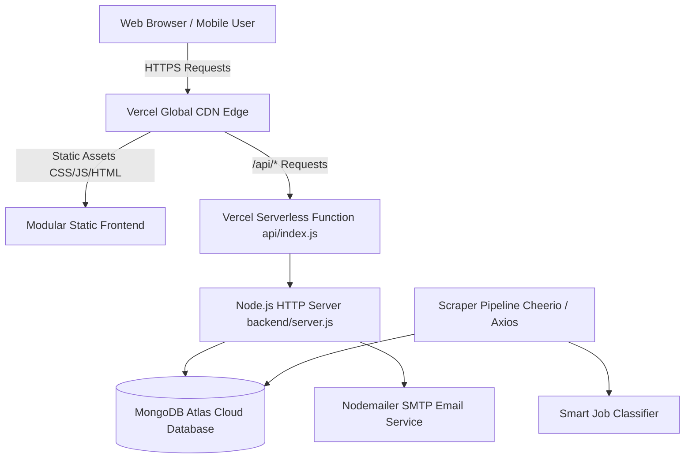

# 🏛️ Sarkari Hith (sarkari hith 2026)

[](https://vercel.com)
[](https://www.mongodb.com/atlas)
[](https://nodejs.org)
[](https://developer.mozilla.org)
[](https://developer.mozilla.org)
[](https://vercel.com/analytics)

> **High-speed, authoritative government recruitment, admit card, examination result, and student welfare portal for Indian aspirants.**

---

## 📌 Table of Contents

- [Overview](#-overview)
- [Key Features](#-key-features)
- [Architecture & Tech Stack](#-architecture--tech-stack)
- [Project Directory Structure](#-project-directory-structure)
- [Getting Started](#-getting-started)
  - [Prerequisites](#prerequisites)
  - [Local Installation](#local-installation)
  - [Running the Application](#running-the-application)
- [Environment Configuration](#-environment-configuration)
- [Automation & Background Services](#-automation--background-services)
  - [Web Scraper Pipeline](#1-web-scraper-pipeline)
  - [MongoDB Atlas Data Sync](#2-mongodb-atlas-data-sync)
  - [Daily Job Alerts & Deadline Reminders](#3-daily-job-alerts--deadline-reminders)
- [REST API Reference](#-rest-api-reference)
- [Vercel Deployment Guide](#-vercel-deployment-guide)
- [Security Hardening](#-security-hardening)
- [Contributing & Guidelines](#-contributing--guidelines)
- [License](#-license)

---

## 🌟 Overview

**Sarkari Hith** is designed to eliminate information fragmentation for millions of government exam candidates. Built with a performance-first mindset, it serves real-time exam notifications, hall tickets, cutoff results, answer keys, and syllabus PDFs through an ultra-dense, responsive UI backed by lightweight Node.js microservices and cloud-native MongoDB Atlas storage.

---

## 🚀 Key Features

### 1. 3-Column Core Information Matrix
- **Latest Jobs**: Central and State government vacancies with direct application links, eligibility, and fee structure.
- **Admit Cards**: Exam city intimation slips, hall tickets, and PET/PST call letters.
- **Results**: Real-time merit lists, answer key cutoffs, and scorecards.

### 2. Live Announcement & Breaking News Ticker
- Real-time animated ticker alerting candidates to urgent deadlines, exam date postponements, and freshly released notices.

### 3. Multi-Dimensional Smart Filters
- **Qualification**: 10th Pass, 12th Pass, ITI, Diploma, Graduate (B.Tech, B.Sc, B.Com, B.A), Post Graduate, B.Ed/TET.
- **Sector**: Defense & Police, Railways (RRB), Civil Services (UPSC/State PSC), Banking (IBPS/SBI), SSC, Teaching, Healthcare.
- **State / Region**: All-India National vs. State-specific (UP, Bihar, Delhi, Rajasthan, MP, Haryana, etc.).
- **Search**: Instant debounced full-text search across titles, organizations, and exam tags.

### 4. Candidate Welfare & Utility Modules
- **Job Tracker & Deadlines**: Candidates can bookmark vacancies, set their application status (`Interested`, `Applied`), and receive countdown notices as deadlines approach.
- **Degree-Matched Email Alerts**: Aspirants subscribe with their degree and state; the system automatically matches and dispatches notification emails when relevant vacancies open.
- **Answer Keys & Objection Windows**: Official provisional & final keys with objection raise links.
- **Syllabus & Scheme**: Direct official PDF links to exam patterns and detailed marking schemes.
- **Certificates & Verification**: Direct links for UP/Bihar/Central certificates, EWS, Caste, Domicile, and Aadhaar-PAN linking.

### 5. Premium UI / UX
- **Theme Support**: Seamless toggle between crisp authoritative Light Mode and eye-friendly Dark Slate Mode.
- **Mobile-First Design**: Optimized for 320px–480px viewports (over 85% of exam aspirants browse on smartphones).
- **Vercel Web Analytics**: Privacy-first, real-time traffic insights and conversion tracking for search queries and alert subscriptions.

---

## 🏗️ Architecture & Tech Stack



### Technology Breakdown

| Component | Technology | Rationale |
| :--- | :--- | :--- |
| **Frontend UI** | HTML5 Semantic, Modular CSS3 | Zero framework overhead, instantaneous First Contentful Paint (<200ms). |
| **Client Logic** | Modern Vanilla JavaScript (ES6+ Modules) | Native browser execution without bundler friction (`api.js`, `state.js`, `components.js`, `app.js`). |
| **Backend Runtime** | Node.js (v20+) | Native HTTP server, zero unnecessary external server bloat. |
| **Serverless Layer**| Vercel Serverless Functions (`api/index.js`) | Auto-scaling global compute for `/api/*` endpoints. |
| **Cloud Database**| MongoDB Atlas Cloud | Scalable, persistent cloud collection storage for jobs, results, subscribers, and logs. |
| **Data Ingestion** | Cheerio, Axios, Puppeteer (Dev) | Resilient web scraping pipeline from official government notification portals. |
| **Notifications** | Nodemailer | Automated degree-matched vacancy dispatches & 6:00 PM deadline reminders. |
| **Analytics** | `@vercel/analytics` Edge Script | Built-in real-time analytics with zero performance penalty. |

---

## 📂 Project Directory Structure

```text
Sarkari_Result/
├── .gitignore                      # Git exclusion rules (node_modules, logs, secrets)
├── AGENTS.md                       # AI coding memory, directory boundary rules & constraints
├── DEVELOPMENT_GUIDELINES.md       # Master architectural blueprint & API contracts
├── README.md                       # Project documentation (this file)
├── package.json                    # Root package descriptor for Vercel deployment
├── vercel.json                     # Vercel deployment, CDN output directory & rewrite rules
│
├── api/                            # Vercel Serverless Function entrypoint
│   └── index.js                    # Dispatches /api requests to backend server
│
├── frontend/                       # Client-side Single Page Application (SPA)
│   ├── index.html                  # Accessible HTML5 semantic shell & analytics scripts
│   ├── assets/                     # Branding, logos, and hero imagery
│   │   └── images/                 # sarkari_hith_logo.jpg, parliament_hero.jpg
│   ├── css/                        # Modular stylesheet architecture
│   │   ├── variables.css           # Design tokens, color palette, shadows, typography
│   │   ├── base.css                # CSS reset, container system, global typography
│   │   ├── components.css          # Cards, matrix columns, badges, modals, ticker
│   │   └── responsive.css          # Breakpoint rules for mobile & tablet screens
│   ├── js/                         # Modular client JavaScript architecture
│   │   ├── api.js                  # Fetch wrapper, backend fallback, analytics tracking
│   │   ├── state.js                # Centralized reactive state store & theme switcher
│   │   ├── components.js           # Reusable DOM renderers & detail modal templates
│   │   └── app.js                  # Entry point, event listeners, debounce search
│   └── data/                       # Fallback static datasets for offline resilience
│       ├── allData.json            # Master aggregated portal data
│       └── categories.json         # Department taxonomy
│
└── backend/                        # Node.js backend services & data management
    ├── package.json                # Backend scripts & runtime dependencies
    ├── server.js                   # Node.js HTTP router, rate-limiting & static server
    ├── .env.example                # Template for required environment variables
    └── src/
        ├── data/                   # Fallback local seed files
        └── services/               # Core backend business logic
            ├── mongoService.js     # MongoDB Atlas connection & collection operations
            ├── notificationService.js# Unified notification facade
            ├── notifications/      # Modular notification subsystem
            │   ├── constants.js    # Sanitizers, validation regexes & paths
            │   ├── dispatcher.js   # Email batch delivery & deadline runners
            │   ├── emailTemplates.js# High-fidelity responsive HTML email templates
            │   ├── emailTransporter.js# SMTP transport & dispatch logging
            │   ├── jobTrackerStore.js# Deadline countdown tracking & status store
            │   ├── sentHistoryStore.js# Deduplication history store
            │   ├── subscriberStore.js# Subscriber profiles & degree matching
            │   └── subscriberStatusService.js # 6:00 PM reminder diagnostic engine
            └── scraper/            # Data extraction & parsing pipeline
                ├── classifier.js   # NLP/Regex classification for eligibility & qualifications
                ├── sarkariScraper.js# HTML extractor using Cheerio
                └── runScraper.js   # Batch scraper execution pipeline
```

---

## 💻 Getting Started

### Prerequisites

- **Node.js**: `v20.0.0` or higher
- **npm**: `v9.0.0` or higher
- **Git**

### Local Installation

1. **Clone the repository:**
   ```bash
   git clone https://github.com/Inscrutable21/Sarkari_Result.git
   cd Sarkari_Result
   ```

2. **Install dependencies:**
   ```bash
   # Install root serverless dependencies
   npm install

   # Install backend dependencies
   cd backend
   npm install
   cd ..
   ```

### Running the Application

#### Option A: Start the Integrated Node.js Server (Recommended for Local Dev)
The Node.js server automatically serves the frontend static files and exposes all public `/api/*` endpoints on a single port:

```bash
cd backend
npm run dev
```

Open your browser at **`http://localhost:3000`**.

#### Option B: Production Server Run
```bash
cd backend
npm start
```

---

## ⚙️ Environment Configuration

Create a `.env` file inside the `backend/` directory (or configure these variables in the **Vercel Dashboard > Settings > Environment Variables**):

```env
# Application Port (defaults to 3000)
PORT=3000

# Cloud Database Configuration
MONGODB_URI=mongodb+srv://<username>:<password>@cluster.mongodb.net/?retryWrites=true&w=majority
MONGODB_DB_NAME=sarkari_hith

# SMTP Email Configuration (for Job Alerts & Deadlines)
EMAIL_USER=your_email@gmail.com
EMAIL_APP_PASSWORD=your_gmail_app_password
NOTIFICATION_FROM_EMAIL="Sarkari Hith Job Alerts" <your_email@gmail.com>

# Automated Daily Reminder Schedule (IST Timezone)
TIMEZONE=Asia/Kolkata
REMINDER_TRIGGER_HOUR=18
REMINDER_TRIGGER_MINUTE=0

# Vercel Cron Secret (for scheduled daily cloud executions)
CRON_SECRET=your_vercel_cron_secret
```

---

## 🤖 Automation & Background Services

### 1. Web Scraper Pipeline
Scrapes the latest government recruitment notices, parses qualification requirements, and classifies them by department:

```bash
cd backend
npm run scrape
```

### 2. MongoDB Atlas Data Sync
Synchronize seed datasets and ensure cloud collection indexes are healthy:

```bash
cd backend
npm run sync:mongo
```

### 3. Daily Job Alerts & Deadline Reminders
Scans candidate subscriptions and active job deadlines, automatically dispatching personalized HTML email alerts:

```bash
cd backend
npm run notify
```

---

## 🔌 REST API Reference

All backend responses return standard JSON envelopes adhering to the project specification:  
`{ "success": true, "data": [...], "meta": { ... } }`

### Public Portal & Candidate Endpoints

| Method | Endpoint | Description | Parameters / Payload |
| :--- | :--- | :--- | :--- |
| `GET` | `/api/health` | Healthcheck and service uptime telemetry | None |
| `GET` | `/api/all` | Complete portal dataset (jobs, admit cards, results, ticker) | None |
| `GET` | `/api/jobs` | Filtered list of government recruitment postings | `?sector=...&state=...&qualification=...&q=...&activeOnly=true` |
| `GET` | `/api/admit-cards` | Active examination admit cards & hall tickets | `?q=...` |
| `GET` | `/api/results` | Declared examination results & merit lists | `?q=...` |
| `GET` | `/api/categories` | Department categories & current vacancy counts | None |
| `GET` | `/api/details` | Extract deep specifications for a specific recruitment notice | `?url=https://...` |
| `POST` | `/api/subscribe` | Register candidate for qualification-matched job alerts | Body: `{ email, name, qualification, state, sector }` |
| `GET` | `/api/subscriptions` | Check candidate subscription status | `?email=candidate@example.com` |
| `POST` | `/api/unsubscribe` | Unsubscribe from email job alerts | Body: `{ email }` |
| `POST` | `/api/track-job` | Save job to candidate's personal deadline tracker | Body: `{ email, jobId, jobTitle, lastDate, link }` |
| `GET` | `/api/track-job/list` | Retrieve tracked job deadlines for candidate | `?email=candidate@example.com` |
| `POST` | `/api/track-job/apply` | Update job application status (`applied` / `pending`) | Body: `{ trackId, status, email, jobId, jobTitle }` |
| `GET` | `/api/track-job/status` | Candidate quick-response link from reminder email | `?trackId=...&status=applied&email=...` |
| `POST` | `/api/track-job/schedule-timer` | Schedule a 1-minute test reminder for validation | Body: `{ email, jobId, jobTitle, lastDate }` |
| `GET` | `/api/track-job/active-timers` | View active countdown timers for email | `?email=candidate@example.com` |

---

## 🚀 Vercel Deployment Guide

The repository is configured for **Zero-Config Vercel Deployment**:

1. **Push your code to GitHub / GitLab**.
2. **Import the repository** into [Vercel](https://vercel.com/new).
3. **Project Settings**:
   - **Framework Preset**: `Other`
   - **Root Directory**: `./`
   - **Output Directory**: Automatically set to `frontend` via [vercel.json](vercel.json).
4. **Environment Variables**: Add `MONGODB_URI`, `EMAIL_USER`, `EMAIL_APP_PASSWORD`, `CRON_SECRET`, etc. in Vercel settings.
5. **Deploy**: Vercel will deploy the static frontend to its global CDN and mount [api/index.js](api/index.js) as a Serverless Function for all `/api/*` traffic.
6. **Activate Analytics**: In the Vercel Dashboard, navigate to the **Analytics** tab and click **Enable Web Analytics**.

---

## 🛡️ Security Hardening

- **Defensive HTTP Headers**: Responses enforce strict headers (`X-Content-Type-Options: nosniff`, `X-Frame-Options: SAMEORIGIN`, `Referrer-Policy: strict-origin-when-cross-origin`, and `Permissions-Policy`).
- **IP Rate Limiting**: In-memory rate limiting shields public endpoints against automated spam and denial-of-service attempts.
- **SSRF Prevention**: The scraper URL engine strictly restricts scraping to authorized government notification domains.
- **XSS Escaping**: All dynamic DOM renderers in [frontend/js/components.js](frontend/js/components.js) pass data through strict HTML entity encoding.
- **PII Protection**: Candidate job tracking and notification logs require candidate email authentication, preventing bulk data scraping.
- **Cryptographic Timing-Safe Comparison**: All sensitive validation operations utilize `crypto.timingSafeEqual` to thwart timing side-channel attacks.

---

## 🤝 Contributing & Guidelines

Before proposing changes, please review our master specification documents:
- [DEVELOPMENT_GUIDELINES.md](DEVELOPMENT_GUIDELINES.md) — Comprehensive architectural specifications & coding standards.
- [AGENTS.md](AGENTS.md) — Agent boundaries, directory placement rules, and data contract consistency.

---

## 📄 License

This project is licensed under the [MIT License](LICENSE).