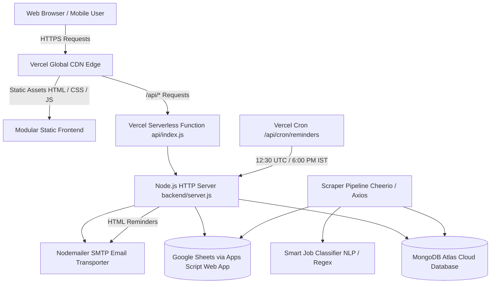

# 🏛️ Sarkari Hith (sarkari hith 2026)

[](https://vercel.com)
[](https://www.mongodb.com/atlas)
[](https://developers.google.com/sheets/api)
[](https://nodejs.org)
[](https://developer.mozilla.org)
[](https://developer.mozilla.org)
[](https://vercel.com/analytics)
[](LICENSE)

> **High-speed, authoritative government recruitment, admit card, examination result, and student welfare portal for Indian aspirants.**

---

## 📌 Table of Contents

- [Overview](#-overview)
- [Key Features & Modules](#-key-features--modules)
  - [1. 3-Column Core Information Matrix](#1-3-column-core-information-matrix)
  - [2. Secondary Services & Candidate Welfare](#2-secondary-services--candidate-welfare)
  - [3. Live Announcement & Breaking News Ticker](#3-live-announcement--breaking-news-ticker)
  - [4. Multi-Dimensional Filter & Search Engine](#4-multi-dimensional-filter--search-engine)
  - [5. Personal Job Tracker & Deadline Reminders](#5-personal-job-tracker--deadline-reminders)
  - [6. Qualification-Matched Email Alerts](#6-qualification-matched-email-alerts)
  - [7. Executive Admin Control Center](#7-executive-admin-control-center)
  - [8. Clay Minimalist Light Design](#8-clay-minimalist-light-design)
- [Architecture & Tech Stack](#-architecture--tech-stack)
  - [System Flow Diagram](#system-flow-diagram)
  - [Technology Breakdown](#technology-breakdown)
- [Project Directory Structure](#-project-directory-structure)
- [Getting Started](#-getting-started)
  - [Prerequisites](#prerequisites)
  - [Local Installation](#local-installation)
  - [Running the Application](#running-the-application)
- [Environment Configuration](#-environment-configuration)
- [Automation & Background CLI Commands](#-automation--background-cli-commands)
  - [Web Scraper Pipeline](#1-web-scraper-pipeline)
  - [MongoDB Atlas Data Sync](#2-mongodb-atlas-data-sync)
  - [Google Sheets Realtime Sync](#3-google-sheets-realtime-sync)
  - [Daily Job Alerts & Deadline Dispatcher](#4-daily-job-alerts--deadline-dispatcher)
- [Comprehensive REST API Reference](#-comprehensive-rest-api-reference)
  - [Standard Response Envelope](#standard-response-envelope)
  - [Public Portal Endpoints](#public-portal-endpoints)
  - [Candidate Tracker & Subscription Endpoints](#candidate-tracker--subscription-endpoints)
  - [Scheduled Cron Endpoints](#scheduled-cron-endpoints)
  - [Administrative & Auth Endpoints](#administrative--auth-endpoints)
- [Executive Admin Console Guide](#-executive-admin-console-guide)
- [Deployment Guide](#-deployment-guide)
  - [Deploying to Vercel (Recommended)](#deploying-to-vercel-recommended)
  - [Deploying on Traditional VPS / Docker / PM2](#deploying-on-traditional-vps--docker--pm2)
- [Security Hardening](#-security-hardening)
- [Contributing & Development Guidelines](#-contributing--development-guidelines)
- [License](#-license)

---

## 🌟 Overview

**Sarkari Hith** is designed to eliminate information fragmentation for millions of Indian government examination aspirants. Built with a strict **performance-first and zero-bloat architecture**, the portal delivers real-time recruitment notices, hall tickets, cutoff results, answer keys, and syllabus PDFs via an ultra-dense, responsive UI backed by native Node.js microservices and cloud-native MongoDB Atlas storage with Google Sheets real-time synchronization.

Key design tenants:
- **Sub-200ms First Contentful Paint (FCP)** using lightweight vanilla ES6+ modules and zero runtime client-side frameworks.
- **Mobile-First Ergonomics**: Over 85% of exam candidates browse government notifications on smartphones; all tables, matrices, and modals are tailored for 320px–480px touch devices.
- **High Information Density**: Clean tabular categorization ensuring candidates spot critical dates, eligibility criteria, and official application links within seconds.

---

## 🚀 Key Features & Modules

### 1. 3-Column Core Information Matrix
The centerpiece of the portal organizes recruitment updates into three high-contrast, scan-friendly columns:
- **Latest Jobs**: Central and State government recruitment notifications with direct official application links, eligibility requirements, and fee structures.
- **Admit Cards**: Exam city intimation slips, computer-based test (CBT) hall tickets, and physical efficiency test (PET/PST) call letters.
- **Results**: Real-time selection lists, final merit cutoffs, scorecards, and declared marksheets.

### 2. Secondary Services & Candidate Welfare
- **Answer Keys & Objection Windows**: Direct access to provisional and final answer keys with official objection challenge portals.
- **Syllabus & Exam Pattern**: Direct PDF links to official exam schemes, question distribution, and marking patterns.
- **Admissions & Entrance Forms**: Central university, polytechnic, and entrance exam application deadlines.
- **Certificates & Verification**: Official government portals for Caste, Income, EWS, Domicile certificates, and PAN-Aadhaar verification.

### 3. Live Announcement & Breaking News Ticker
- A marquee ticker bar with a live pulsing status indicator alerts candidates to urgent deadlines, exam postponements, and freshly announced recruitment cycles.

### 4. Multi-Dimensional Filter & Search Engine
- **Full-Text Instant Search**: Debounced real-time search across job titles, organizing commissions, and vacancy tags.
- **Sector & Department**: Defense & Police, Railways (RRB), Civil Services (UPSC / State PSC), Banking (IBPS / SBI), Staff Selection (SSC), Teaching, Healthcare, and Engineering.
- **Educational Qualification**: 10th Pass, 12th Pass, ITI, Diploma, Graduate (B.Tech, B.Sc, B.Com, B.A), Post Graduate, and B.Ed/TET.
- **State / Regional Scope**: All-India National vs. State-specific recruitment (UP, Bihar, Delhi, Rajasthan, MP, Haryana, etc.).
- **Active Deadlines Toggle**: Filter to only display posts whose application windows are currently open.

### 5. Personal Job Tracker & Deadline Reminders
- Candidates can bookmark jobs to their personal browser tracker (`Interested` or `Applied`).
- Real-time countdown badges indicate remaining days until the application window closes.
- Candidates can schedule automated email countdown reminders for tracked posts.

### 6. Qualification-Matched Email Alerts
- Aspirants subscribe by submitting their email along with their highest educational qualification, preferred sector, and state.
- The automated notification engine continuously checks newly scraped posts against subscriber preferences and sends responsive HTML notification emails with official application links.
- Automated daily deadline reminders dispatch at **6:00 PM IST (12:30 UTC)** for approaching application closures.

### 7. Executive Admin Control Center
Accessible at `/admin` (or `/admin.html`), the dark glassmorphic control center provides system administrators with:
- **Role-Based Access Control (RBAC)**: Master API key authentication with signed cryptographic session tokens.
- **Live Subscriber Diagnostics Engine**: Detailed visibility into subscriber profiles, eligible job counts, and delivery trigger statuses.
- **Manual & Batch Reminders**: Trigger individual test reminders or batch dispatches with a single click.
- **On-Demand Scraper Pipeline**: Trigger background scraper execution directly from the console.
- **Dual Cloud Sync**: Real-time synchronization triggers for both MongoDB Atlas and Google Sheets.

### 8. Clay Minimalist Light Design
- Clean, eye-friendly light aesthetic using modern typography (Plus Jakarta Sans, Inter, JetBrains Mono).
- Subtle borders, tonal badge styling, and high-contrast pill selectors.
- Fully responsive layout featuring a sticky top announcement bar, quick tags carousel, and a mobile bottom navigation dock.

---

## 🏗️ Architecture & Tech Stack

### System Flow Diagram



### Technology Breakdown

| Component | Technology | Rationale |
| :--- | :--- | :--- |
| **Frontend UI** | HTML5 Semantic, Modular CSS3 | Zero framework overhead, instantaneous First Contentful Paint (<200ms). |
| **Client Logic** | Vanilla JavaScript (ES6+ Modules) | Native browser execution without bundler friction (`api.js`, `state.js`, `components.js`, `app.js`). |
| **Backend Runtime** | Node.js (v20+) | Native HTTP server, zero heavy web framework overhead. |
| **Serverless Gateway** | Vercel Serverless Function (`api/index.js`) | Auto-scaling global edge compute for all `/api/*` endpoints. |
| **Primary Database** | MongoDB Atlas Cloud | Scalable cloud document storage for jobs, subscribers, logs, and tracking. |
| **Secondary Sync** | Google Sheets API (Apps Script) | Real-time dual sync enabling non-technical stakeholders to inspect live data in Google Sheets. |
| **Data Scraping** | Cheerio, Axios, Puppeteer (Dev) | Resilient web scraping pipeline extracting notices from official commission portals. |
| **Notification Engine** | Nodemailer | Automated degree-matched vacancy notifications and daily 6:00 PM deadline alerts. |
| **Analytics** | Vercel Web Analytics | Privacy-first, real-time telemetry and conversion tracking. |

---

## 📂 Project Directory Structure

```text
Sarkari_Result/
├── .gitignore                      # Git exclusion rules (node_modules, logs, secrets)
├── AGENTS.md                       # AI coding memory, directory boundary rules & constraints
├── DEVELOPMENT_GUIDELINES.md       # Master architectural blueprint & API contracts
├── README.md                       # Complete project documentation (this file)
├── package.json                    # Root package descriptor for Vercel deployment
├── vercel.json                     # Vercel deployment, CDN output directory & rewrite rules
│
├── api/                            # Vercel Serverless Function entrypoint
│   └── index.js                    # Dispatches /api requests to backend server
│
├── frontend/                       # Client-side Single Page Application (SPA)
│   ├── index.html                  # Accessible HTML5 semantic shell & analytics scripts
│   ├── admin.html                  # Executive Admin Control Center console
│   ├── sitemap.xml                 # Search engine sitemap index
│   ├── robots.txt                  # Search crawler directives
│   ├── assets/                     # Branding, logos, and hero imagery
│   │   └── images/                 # sarkari_hith_logo.jpg, parliament_hero.jpg
│   ├── css/                        # Modular stylesheet architecture
│   │   ├── variables.css           # Design tokens, color palette, shadows, typography
│   │   ├── base.css                # CSS reset, container system, global typography
│   │   ├── components.css          # Cards, matrix columns, badges, modals, ticker
│   │   ├── responsive.css          # Breakpoint rules for mobile & tablet screens
│   │   └── admin.css               # Glassmorphic executive console styling
│   ├── js/                         # Modular client JavaScript architecture
│   │   ├── api.js                  # Fetch wrapper, backend fallback, analytics tracking
│   │   ├── state.js                # Centralized reactive state store
│   │   ├── components.js           # Reusable DOM renderers & detail modal templates
│   │   ├── app.js                  # Main entry point, event listeners, debounced search
│   │   └── admin.js                # Admin console authentication & management logic
│   └── data/                       # Fallback static datasets for offline resilience
│       ├── allData.json            # Master aggregated portal data
│       └── categories.json         # Department taxonomy
│
└── backend/                        # Node.js backend services & data management
    ├── package.json                # Backend scripts & runtime dependencies
    ├── server.js                   # Node.js HTTP router, rate-limiting & static server
    ├── .env                        # Local environment variables (gitignored)
    ├── .env.example                # Sample environment configuration template
    └── src/
        ├── data/                   # Fallback local seed files (jobs, results, admit cards)
        └── services/               # Core backend business logic
            ├── authService.js      # Cryptographic admin tokens & RBAC permissions
            ├── mongoService.js     # MongoDB Atlas connection & collection operations
            ├── googleSheetService.js # Google Apps Script Web App sync operations
            ├── notificationService.js # Unified notification facade
            ├── setupGoogleSheet.js # Apps Script template generator
            ├── pushAllDataToMongo.js # Batch cloud sync script for MongoDB Atlas
            ├── pushAllDataToSheet.js # Batch sync script for Google Sheets
            ├── migrateToGoogleSheet.js # Migration helper for Google Sheets
            ├── sendNotifications.js # CLI runner for daily alerts & deadline reminders
            ├── notifications/      # Modular notification subsystem
            │   ├── constants.js    # Sanitizers, validation regexes & paths
            │   ├── dispatcher.js   # Email batch delivery & deadline runners
            │   ├── emailTemplates.js # High-fidelity responsive HTML email templates
            │   ├── emailTransporter.js # SMTP transport & dispatch logging
            │   ├── jobTrackerStore.js # Deadline countdown tracking & status store
            │   ├── sentHistoryStore.js # Deduplication history store
            │   ├── subscriberStore.js # Subscriber profiles & degree matching
            │   └── subscriberStatusService.js # 6:00 PM reminder diagnostic engine
            └── scraper/            # Data extraction & parsing pipeline
                ├── classifier.js   # NLP/Regex classification for eligibility & qualifications
                ├── sarkariScraper.js # HTML extractor using Cheerio
                └── runScraper.js   # Batch scraper execution pipeline
```

---

## 💻 Getting Started

### Prerequisites

- **Node.js**: `v20.0.0` or higher
- **npm**: `v9.0.0` or higher
- **Git**

### Local Installation

1. **Clone the repository:**
   ```bash
   git clone https://github.com/Inscrutable21/Sarkari_Result.git
   cd Sarkari_Result
   ```

2. **Install dependencies:**
   ```bash
   # Install root dependencies
   npm install

   # Install backend dependencies
   cd backend
   npm install
   cd ..
   ```

3. **Configure Environment Variables:**
   Copy the example environment configuration into `backend/.env`:
   ```bash
   cp backend/.env.example backend/.env
   ```
   Edit `backend/.env` with your MongoDB URI, SMTP credentials, and admin API key.

### Running the Application

#### Option A: Local Development with Hot Reload (Recommended)
The integrated Node.js server serves both the static frontend and the `/api/*` endpoints with native file-watching:
```bash
cd backend
npm run dev
```
Open your browser at **`http://localhost:3000`**.

#### Option B: Production Server Run
```bash
cd backend
npm start
```

---

## ⚙️ Environment Configuration

Configure the following variables in `backend/.env` (or via **Vercel Dashboard > Settings > Environment Variables**):

| Variable | Required | Default | Description |
| :--- | :---: | :--- | :--- |
| `PORT` | Optional | `3000` | Port for the local Node.js server. |
| `PORTAL_URL` | Optional | `http://localhost:3000` | Canonical public URL used in email templates and status callbacks. |
| `MONGODB_URI` | **Required** | — | MongoDB Atlas connection string (`mongodb+srv://...`). |
| `MONGODB_DB_NAME` | Optional | `sarkari_hith` | Database name in MongoDB Atlas. |
| `ADMIN_API_KEY` | **Required** | — | Master administrative key for console access, scraping, and token generation. |
| `SESSION_SECRET` | Optional | fallback | Secret string used for signing cryptographic admin session tokens. |
| `EMAIL_USER` / `SMTP_USER` | Optional | — | SMTP email address used to dispatch job alerts and deadline reminders. |
| `EMAIL_APP_PASSWORD` / `SMTP_PASS` | Optional | — | SMTP App Password or credential. |
| `SMTP_HOST` | Optional | `smtp.gmail.com` | Custom SMTP relay host. |
| `SMTP_PORT` | Optional | `465` | SMTP port (`465` for SSL, `587` for TLS). |
| `NOTIFICATION_FROM_EMAIL` | Optional | formatted | Sender header displayed in candidate email inboxes. |
| `GOOGLE_SHEET_WEBAPP_URL` | Optional | — | Google Apps Script deployment URL for real-time sheet synchronization. |
| `GOOGLE_SHEET_SECRET_KEY` | Optional | — | Secret passkey authenticating calls to the Google Apps Script Web App. |
| `CRON_SECRET` | Optional | — | Bearer secret authenticating Vercel Cron invocations (`/api/cron/reminders`). |
| `TIMEZONE` | Optional | `Asia/Kolkata` | Timezone for reminder calculations (IST). |
| `REMINDER_TRIGGER_HOUR` | Optional | `18` | Daily hour to trigger deadline reminders (18 = 6:00 PM IST). |
| `REMINDER_TRIGGER_MINUTE`| Optional | `0` | Daily minute to trigger deadline reminders. |

---

## 🤖 Automation & Background CLI Commands

All automation tasks can be run directly from the `backend/` directory using npm scripts:

### 1. Web Scraper Pipeline
Scrapes official commission notices, parses application deadlines, and classifies posts using NLP/regex:
```bash
cd backend
npm run scrape
```

### 2. MongoDB Atlas Data Sync
Pushes local seed datasets to MongoDB Atlas collections, ensuring proper indexes are created:
```bash
cd backend
npm run sync:mongo
```

### 3. Google Sheets Realtime Sync
Pushes aggregated portal data directly to a connected Google Sheet via Google Apps Script:
```bash
cd backend
npm run sync:sheets
```

### 4. Daily Job Alerts & Deadline Dispatcher
Scans candidate subscriptions and active job deadlines, automatically dispatching personalized HTML email alerts:
```bash
cd backend
npm run notify
```

---

## 🔌 Comprehensive REST API Reference

### Standard Response Envelope
All backend endpoints return responses in a standardized JSON structure:

```json
{
  "success": true,
  "data": [],
  "meta": {
    "total": 0,
    "timestamp": "2026-10-04T00:00:00.000Z"
  }
}
```
Errors return `{ "success": false, "error": "Descriptive message" }`.

### Public Portal Endpoints

| Method | Endpoint | Description | Query Parameters |
| :--- | :--- | :--- | :--- |
| `GET` | `/api/health` | Service healthcheck and uptime telemetry | None |
| `GET` | `/api/all` | Complete portal dataset (jobs, admit cards, results, ticker) | None |
| `GET` | `/api/jobs` | Filtered list of government recruitment postings | `?sector=...&state=...&qualification=...&q=...&activeOnly=true` |
| `GET` | `/api/admit-cards` | Active examination admit cards & hall tickets | `?q=...` |
| `GET` | `/api/results` | Declared examination results & merit lists | `?q=...` |
| `GET` | `/api/categories` | Department categories & current vacancy counts | None |
| `GET` | `/api/details` | Extract deep specifications for a specific notice (SSRF protected) | `?url=https://...` |

### Candidate Tracker & Subscription Endpoints

| Method | Endpoint | Description | Request Payload / Query |
| :--- | :--- | :--- | :--- |
| `POST` | `/api/subscribe` | Register candidate for qualification-matched alerts | `{ "email": "...", "name": "...", "qualification": "...", "state": "...", "sector": "..." }` |
| `GET` | `/api/subscriptions` | Check candidate subscription status | `?email=candidate@example.com` |
| `POST` | `/api/unsubscribe` | Unsubscribe from email alerts | `{ "email": "candidate@example.com" }` |
| `POST` | `/api/track-job` | Save job to candidate's personal deadline tracker | `{ "email": "...", "jobId": "...", "jobTitle": "...", "lastDate": "...", "link": "..." }` |
| `GET` | `/api/track-job/list` | Retrieve tracked job deadlines for candidate | `?email=candidate@example.com` |
| `POST` | `/api/track-job/apply` | Update job application status (`applied` / `pending`) | `{ "trackId": "...", "status": "applied", "email": "..." }` |
| `GET` | `/api/track-job/status` | Quick-response one-click link from reminder emails | `?trackId=...&status=applied&email=...` |
| `POST` | `/api/track-job/schedule-timer` | Schedule a 1-minute test reminder for validation | `{ "email": "...", "jobId": "...", "jobTitle": "...", "lastDate": "..." }` |
| `POST` | `/api/track-job/send-reminder-now`| Dispatch an instant deadline reminder email | `{ "email": "...", "jobTitle": "...", "lastDate": "..." }` |
| `GET` | `/api/track-job/active-timers` | View active countdown timers for email | `?email=candidate@example.com` |

### Scheduled Cron Endpoints

| Method | Endpoint | Description | Authentication |
| :--- | :--- | :--- | :--- |
| `GET` / `POST` | `/api/cron/reminders` | Automated daily 6:00 PM IST deadline reminder execution | `Bearer <CRON_SECRET>` or Admin Token |
| `POST` | `/api/notifications/reminders/send`| Manual trigger for daily deadline reminders | Master API Key |

### Administrative & Auth Endpoints

| Method | Endpoint | Description | Required Auth |
| :--- | :--- | :--- | :--- |
| `POST` | `/api/auth/login` | Authenticate Single Admin Key & issue signed session token | Body: `{ "apiKey": "..." }` |
| `POST` | `/api/auth/rotate` | Rotate active session token | `ADMIN_API_KEY` + Session Token |
| `POST` | `/api/auth/revoke-all` | Revoke all active administrative sessions | Master API Key |
| `GET` | `/api/auth/verify` | Verify session token validity and permissions | Bearer Session Token |
| `GET` | `/api/admin/subscribers-status` | Diagnostic inspection of all subscriber reminder criteria | Admin Token (`subscribers:read`) |
| `POST` | `/api/admin/subscribers/send-reminder`| Trigger individual reminder dispatch | Admin Token (`notifications:send`) |
| `POST` | `/api/admin/subscribers/send-all-reminders`| Batch-trigger reminders to all qualified candidates | Admin Token (`notifications:send`) |
| `POST` | `/api/admin/subscribers/delete` | Delete a specific subscriber or tracked job record | Admin Token (`subscribers:delete`) |
| `POST` | `/api/admin/subscribers/clear-all` | Purge all subscriber and tracked job records | Admin Token (`subscribers:delete`) |
| `POST` | `/api/admin/send-test-notification` | Dispatch a live test email to verify SMTP configuration | Admin Token (`notifications:send`) |
| `GET` / `POST` | `/api/scrape` | Trigger live scraping pipeline on demand | Admin Token (`scrape:run`) |
| `GET` / `POST` | `/api/sync-mongo` | Synchronize master datasets to MongoDB Atlas | Admin Token (`system:sync`) |
| `GET` | `/api/mongodb/status` | Check MongoDB Atlas connection and collection counts | Bearer Token / Public status |

---

## 🎛️ Executive Admin Console Guide

The platform includes a dedicated **Executive Admin Control Center** available at:
- **URL**: `http://localhost:3000/admin` (or `/admin.html`)

### Features & Workflow:
1. **Single-Key Authentication**: Enter your `ADMIN_API_KEY` defined in `.env`. The system authenticates the key and issues a signed, cryptographically verified session token stored in browser session memory.
2. **Real-time Diagnostic Dashboard**:
   - Inspect active subscriber count, tracked deadlines, and MongoDB connection health.
   - View exact reasons why a subscriber is eligible or ineligible for today's 6:00 PM reminder (e.g. *Days left: 2*, *Already applied*, *Already sent today*).
3. **One-Click Actions**:
   - **Send Test Reminder**: Verify SMTP transport with an instantaneous test email.
   - **Send All 6:00 PM Reminders**: Force the daily deadline reminder pipeline immediately.
   - **Trigger Live Scraper**: Run Cheerio extraction on-demand without server restarts.
   - **Sync MongoDB**: Flush in-memory or JSON data to persistent Atlas collections.

---

## 🚀 Deployment Guide

### Deploying to Vercel (Recommended)

The repository is configured for **Zero-Config Vercel Deployment**:

1. **Push your code to GitHub / GitLab**.
2. **Import the repository** into [Vercel](https://vercel.com/new).
3. **Project Settings**:
   - **Framework Preset**: `Other`
   - **Root Directory**: `./`
   - **Output Directory**: Automatically handled (`frontend` via [vercel.json](vercel.json)).
4. **Environment Variables**: Add your production variables in the Vercel dashboard:
   - `MONGODB_URI`
   - `ADMIN_API_KEY`
   - `EMAIL_USER`
   - `EMAIL_APP_PASSWORD`
   - `CRON_SECRET`
   - `PORTAL_URL`
5. **Deploy**: Vercel serves the static frontend via its global Edge Network and dispatches all `/api/*` requests through the Serverless Function at [api/index.js](api/index.js).
6. **Automated Reminders**: Vercel Cron is automatically pre-configured in [vercel.json](vercel.json) to execute `/api/cron/reminders` daily at **12:30 UTC (6:00 PM IST)**.

### Deploying on Traditional VPS / Docker / PM2

For dedicated Ubuntu / Debian / CentOS Linux servers:

```bash
# 1. Clone repository
git clone https://github.com/Inscrutable21/Sarkari_Result.git
cd Sarkari_Result/backend

# 2. Install production dependencies
npm ci --omit=dev

# 3. Configure production environment
cp .env.example .env
nano .env

# 4. Start with PM2 process manager
npm install -g pm2
pm2 start server.js --name "sarkari-hith"
pm2 save
pm2 startup
```

---

## 🛡️ Security Hardening

- **Defensive HTTP Headers**: Responses enforce strict headers (`X-Content-Type-Options: nosniff`, `X-Frame-Options: SAMEORIGIN`, `Referrer-Policy: strict-origin-when-cross-origin`, and `Permissions-Policy`).
- **IP Rate Limiting**: In-memory sliding-window rate limiting shields public endpoints against automated spam and denial-of-service attempts.
- **Server-Side Request Forgery (SSRF) Guard**: The detail scraper endpoint strictly validates target URLs, rejecting private IP ranges (`127.0.0.1`, `10.x.x.x`, `192.168.x.x`) and untrusted domains.
- **Cross-Site Scripting (XSS) Prevention**: All dynamic DOM renderers in [frontend/js/components.js](frontend/js/components.js) pass data through strict HTML entity encoding.
- **Cryptographic Timing-Safe Comparison**: All sensitive authorization keys and token validations use `crypto.timingSafeEqual` to thwart timing side-channel attacks.
- **Role-Based Access Control (RBAC)**: Administrative endpoints enforce granular permissions (`scrape:run`, `notifications:send`, `subscribers:delete`, `system:sync`).

---

## 🤝 Contributing & Development Guidelines

Before proposing changes, please review our master specification documents:
- [DEVELOPMENT_GUIDELINES.md](DEVELOPMENT_GUIDELINES.md) — Architectural blueprint, data contracts, and coding rules.
- [AGENTS.md](AGENTS.md) — Agent boundaries, directory placement rules, and data contract consistency.

### Pull Request Checklist:
1. Verify file placement (`frontend/` vs `backend/`).
2. Ensure API responses conform to `{ success: boolean, data: ..., meta: ... }`.
3. Check responsive styling on 320px, 768px, and 1280px viewports.
4. Verify JavaScript syntax via `node -c`.

---

## 📄 License

This project is licensed under the [MIT License](LICENSE).